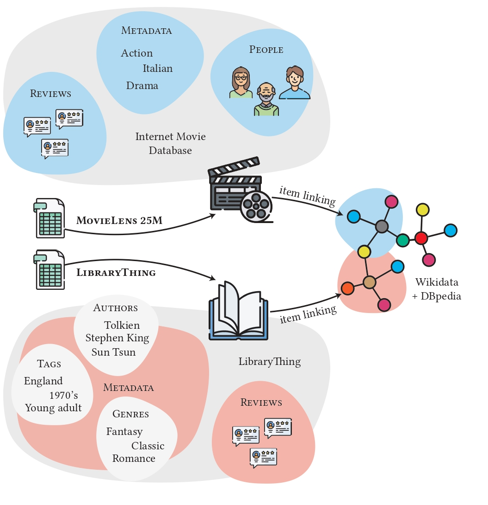
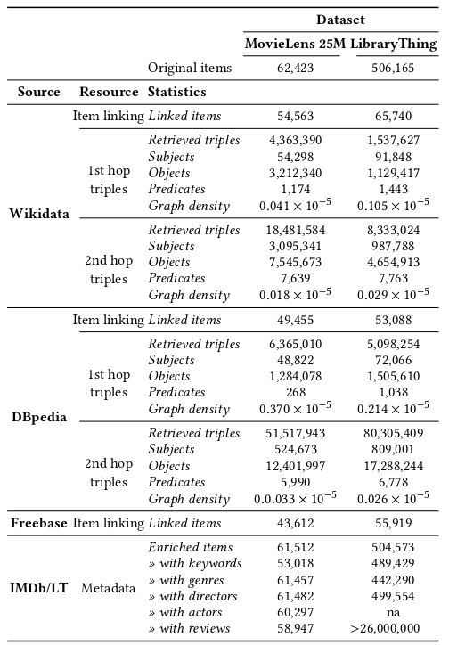

# Augmented and Linked Open Datasets for Recommendation

This is the official repository of the paper *Augmented and Linked Open Datasets for Recommendation*.

Resources are available at https://tny.sh/sisinflab-alod . 


## Overview

Out datasets augment [MovieLens 25M](https://grouplens.org/datasets/movielens/25m/) and [LibraryThing](https://cseweb.ucsd.edu/~jmcauley/datasets.html#social_data) with structured knowldge, metadata and reviews.

<p align="center">

</p>


## Resources

The file are subdivided into tar.gz archives as follows:
  ```shell
  MovieLens 25M
  ├── ml25m_linking.tar.gz
  │   ├── ml25m_linking.tsv   
  ├── ml25m_subgraphs.tar.gz
  │   └── ml25m_wikidata_1hop.tsv
  │   └── ml25m_wikidata_2hop.tsv
  │   └── ml25m_dbpedia_1hop.tsv
  │   └── ml25m_dbpedia_2hop.tsv
  ├── ml25m_metadata.tar.gz
  │   └── ml25m_metadata.tsv
  │   └── ml25m_map_generes.tsv
  ├── ml25m_people.tar.gz
  │   └── ml25m_people.csv
  │   └── ml25m_map_directors.tsv
  │   └── ml25m_map_actors.tsv
  ├── ml25m_reviews.tar.gz
  │   └── ml25m_reviews.tsv

  LibraryThing
  ├── lt_linking.tar.gz
  │   ├── lt_linking.tsv   
  │   ├── lt_wikidata_freebase_linking.tsv   
  │   ├── lt_dbpedia_freebase_linking.tsv   
  ├── lt_subgraphs.tar.gz
  │   └── lt_wikidata_1hop.tsv
  │   └── lt_wikidata_2hop.tsv
  │   └── lt_dbpedia_1hop.tsv
  │   └── lt_dbpedia_2hop.tsv
  ├── lt_metadata.tar.gz
  │   └── lt_metadata.tsv
  │   └── lt_map_generes.tsv
  │   └── lt_map_authors.tsv
  ├── lt_reviews.tar.gz
  │   └── lt_reviews.tsv

  ```

### Resources Statistics

The table below shows the statistics of the collected resource categorized by related datasets and data sources.

<p align="center">

</p>
