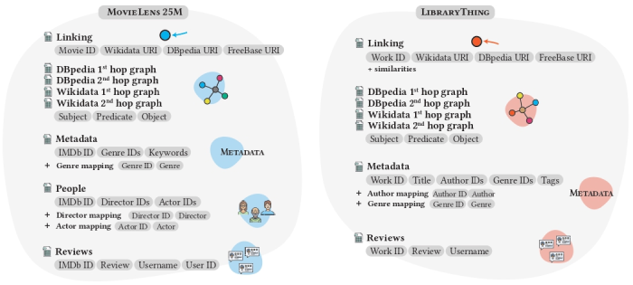

 

[Main page](https://sisinflab.github.io/Augmented-and-Linked-Open-Datasets-for-Recommendation/) - [GitHub Repository](https://github.com/sisinflab/Augmented-and-Linked-Open-Datasets-for-Recommendation/)

# Linked Open Datasets for Recommendation

This is the official repository of the paper *Linked Open Datasets for Recommendation*.
This work covers the enrichment of two widely used recommendation datasets from the movie and book domain, [MovieLens 25M](https://grouplens.org/datasets/movielens/25m/) and [LibraryThing](https://cseweb.ucsd.edu/~jmcauley/datasets.html#social_data) respectively. Specifically:
- we link the items in the LibraryThing (LT) and MovieLens 25M (ML25M) datasets with the entities available in three well-known knowledge graphs: Wikidata, DBpedia, and Freebase;
- starting from item entity linking, we explore the Wikidata and DBpedia knowledge graphs connections up to two hops to collect all the structured information connected to these resources, thus providing persistenta nd ready-to-use enriched datasets for performing reproducible experiments; 

Inspired by the advances in knowledge graph, Graph Convolutional Networks, Link Prediction, and Recommender Systems research, these augmented datasets aim to meet their cutting-edge research needs. Moreover, these datasets pave the way to further research to investigate different recommendation modalities simultaneously.


<!-- <p align="center">

</p> -->

## Download the Datasets
All the resources are available [here]([https://tny.sh/sisinflab-alod](https://politecnicobari-my.sharepoint.com/:f:/g/personal/vincenzo_paparella_poliba_it/EsHpz-l451BMhvKlCWNncjgBYxYazIuHOHhGNInjU8j4ZA?e=2OFWCD)) . 

Please note that the resources cannot be hosted on GitHub due to [GitHub size limits](https://docs.github.com/en/repositories/working-with-files/managing-large-files/about-large-files-on-github).

## Resources
Our resources collect:
- links from Item IDs to URI resources on [Wikidata](https://www.wikidata.org/wiki/Wikidata:Main_Page), [DBpedia](https://www.dbpedia.org/) and [Freebase](https://developers.google.com/freebase) KGs for both movies and books
- RDF-triples from the Wikidata and DBpedia KGs for both movies and books 

The files are split into tar.gz archives as follows:
  ```shell
  MovieLens 25M
  ├── ml25m_linking.tar.gz
  │   ├── ml25m_linking.tsv   
  ├── ml25m_subgraphs.tar.gz
  │   └── ml25m_wikidata_1hop.tsv
  │   └── ml25m_wikidata_2hop.tsv
  │   └── ml25m_dbpedia_1hop.tsv
  │   └── ml25m_dbpedia_2hop.tsv


  LibraryThing
  ├── lt_linking.tar.gz
  │   ├── lt_linking.tsv   
  │   ├── lt_wikidata_freebase_linking.tsv   
  │   ├── lt_dbpedia_freebase_linking.tsv   
  ├── lt_subgraphs.tar.gz
  │   └── lt_wikidata_1hop.tsv
  │   └── lt_wikidata_2hop.tsv
  │   └── lt_dbpedia_1hop.tsv
  │   └── lt_dbpedia_2hop.tsv


  ```
  ### Resources Description
  
  <table>
    <tr>
        <td>File Name </td> 
        <td>Descriptions</td> 
   </tr>
   <tr>
        <td align='center', colspan="2">MovieLens 25M</td>    
   </tr>
   <tr>
        <td>ml25m_linking.tsv</td> 
        <td>This file contains the link of items in the MovieLens 25M dataset to Wikidata, DBpedia, and FreeBase Knowledge Graphs. This is a tab separated file containing the following fields: <ul><li><i>movie_id</i> : the movie identifier in the MovieLens 25M dataset</li><li><i>wikidata_uri</i> : the uri resource on Wikidata associated to the movie </li><li><i>dbpedia_uri </i>: the uri resource on DBpedia associated to the movie  </li><li><i>freebase_uri</i> : the uri resource on FreeBase associated to the movie </li></ul></td> 
   </tr>
  <tr>
        <td>ml25m_wikidata_1hop.tsv</td> 
        <td> This file contains the RDF triples gathered exploring the Wikidata Knowledge Graph up tp 1-hop starting from the uri resources found in the item linking phase concerning the MovieLens 25M dataset. This is a tab separated file containing the following fields: <ul><li><i>subject</i> : the uri resource of the subject in the RDF triple at 1-hop</li><li><i>predicate</i> : the uri resource of the predicate in the RDF triple at 1-hop</li><li><i>object</i> : the uri resource of the object in the RDF triple at 1-hop  </li></ul></td> 
   </tr>
  <tr>
        <td>ml25m_wikidata_2hop.tsv</td> 
        <td> This file contains the RDF triples gathered exploring the Wikidata Knowledge Graph up tp 2-hop starting from the uri resources objects found in the exploration up to 1-hop concerning the MovieLens 25M dataset. This is a tab separated file containing the following fields: <ul><li><i>subject</i> : the uri resource of the subject in the RDF triple at 2-hop (i.e., the object at the 1-hop exploration)</li><li><i>predicate</i> : the uri resource of the predicate in the RDF triple at 2-hop</li><li><i>object</i> : the uri resource of the object in the RDF triple at 2-hop  </li></ul></td> 
   </tr>
    <tr>
        <td>ml25m_dbpedia_1hop.tsv</td> 
        <td> This file contains the RDF triples gathered exploring the DBpedia Knowledge Graph up tp 1-hop starting from the uri resources found in the item linking phase concerning the MovieLens 25M dataset. This is a tab separated file containing the following fields: <ul><li><i>subject</i> : the uri resource of the subject in the RDF triple at 1-hop</li><li><i>predicate</i> : the uri resource of the predicate in the RDF triple at 1-hop</li><li><i>object</i> : the uri resource of the object in the RDF triple at 1-hop  </li></ul></td> 
   </tr>
  <tr>
        <td>ml25m_dbpedia_2hop.tsv</td> 
        <td> This file contains the RDF triples gathered exploring the DBpedia Knowledge Graph up tp 2-hop starting from the uri resources objects found in the exploration up to 1-hop concerning the MovieLens 25M dataset. This is a tab separated file containing the following fields: <ul><li><i>subject</i> : the uri resource of the subject in the RDF triple at 2-hop (i.e., the object at the 1-hop exploration)</li><li><i>predicate</i> : the uri resource of the predicate in the RDF triple at 2-hop</li><li><i>object</i> : the uri resource of the object in the RDF triple at 2-hop  </li></ul></td> 
   </tr>
   <tr>
        <td align='center', colspan="2">LibraryThing</td>    
   </tr>
 <tr>
        <td>lt_linking.tsv</td> 
        <td> This file contains the link of items in the LibraryThing dataset to Wikidata and DBpedia Knowledge Graphs. This is a tab separated file containing the following fields: <ul><li><i>work_id </i>: the book identifier in the LibraryThing dataset</li><li><i>wikidata_uri </i>: the uri resource on Wikidata associated to the book </li><li><i>wikidata_similarity</i> : the similarity between dataset and Wikidata side information value  </li><li><i>dbpedia_uri</i> : the uri resource on DBpedia associated to the book  </li><li><i> dbpedia_similarity</i> : the similarity between dataset and DBpedia side information value </li></ul></td> 
   </tr>
  <tr>
        <td>lt_wikidata_freebase_linking.tsv</td> 
        <td> This file contains the link of items in the LibraryThing dataset to FreeBase Knowledge Graph from Wikidata. This is a tab separated file containing the following fields: <ul><li><i>work_id</i> : the book identifier in the LibraryThing dataset</li><li><i>wikidata_uri</i> : the uri resource on Wikidata associated to the book </li><li><i>wikidata_similarity</i> : the similarity between dataset and Wikidata side information value  </li><li><i>freebase_uri</i> : the uri resource on FreeBase associated to the book from the Wikidata uri </li></ul></td> 
   </tr>
  <tr>
        <td>lt_dbpedia_freebase_linking.tsv</td> 
        <td> This file contains the link of items in the LibraryThing dataset to FreeBase Knowledge Graph from DBpedia. This is a tab separated file containing the following fields: <ul><li><i>work_id</i> : the book identifier in the LibraryThing dataset</li><li><i>dbpedia_uri</i> : the uri resource on DBpedia associated to the book </li><li><i>dbpedia_similarity</i> : the similarity between dataset and DBpedia side information value  </li><li><i>freebase_uri</i> : the uri resource on FreeBase associated to the book from the DBpedia uri </li></ul></td> 
   </tr>
   <tr>
        <td>lt_wikidata_1hop.tsv</td> 
        <td> This file contains the RDF triples gathered exploring the Wikidata Knowledge Graph up tp 1-hop starting from the uri resources found in the item linking phase concerning the LibraryThing dataset. This is a tab separated file containing the following fields: <ul><li><i>subject</i> : the uri resource of the subject in the RDF triple at 1-hop</li><li><i>predicate</i> : the uri resource of the predicate in the RDF triple at 1-hop</li><li><i>object</i> : the uri resource of the object in the RDF triple at 1-hop  </li></ul></td> 
   </tr>
  <tr>
        <td>lt_wikidata_2hop.tsv</td> 
        <td> This file contains the RDF triples gathered exploring the Wikidata Knowledge Graph up tp 2-hop starting from the uri resources objects found in the exploration up to 1-hop concerning the LibraryThing dataset. This is a tab separated file containing the following fields: <ul><li><i>subject</i> : the uri resource of the subject in the RDF triple at 2-hop (i.e., the object at the 1-hop exploration)</li><li><i>predicate</i> : the uri resource of the predicate in the RDF triple at 2-hop</li><li><i>object</i> : the uri resource of the object in the RDF triple at 2-hop  </li></ul></td> 
   </tr>
    <tr>
        <td>lt_dbpedia_1hop.tsv</td> 
        <td> This file contains the RDF triples gathered exploring the DBpedia Knowledge Graph up tp 1-hop starting from the uri resources found in the item linking phase concerning the LibraryThing dataset. This is a tab separated file containing the following fields: <ul><li><i>subject</i> : the uri resource of the subject in the RDF triple at 1-hop</li><li><i>predicate</i> : the uri resource of the predicate in the RDF triple at 1-hop</li><li><i>object</i> : the uri resource of the object in the RDF triple at 1-hop  </li></ul></td> 
   </tr>
  <tr>
        <td>lt_dbpedia_2hop.tsv</td> 
        <td> This file contains the RDF triples gathered exploring the DBpedia Knowledge Graph up tp 2-hop starting from the uri resources objects found in the exploration up to 1-hop concerning the LibraryThing dataset. This is a tab separated file containing the following fields: <ul><li><i>subject</i> : the uri resource of the subject in the RDF triple at 2-hop (i.e., the object at the 1-hop exploration)</li><li><i>predicate</i> : the uri resource of the predicate in the RDF triple at 2-hop</li><li><i>object</i> : the uri resource of the object in the RDF triple at 2-hop  </li></ul></td> 
   </tr>
</table>


### Resources Statistics

The table below shows the statistics of the collected resource categorized by dataset and data source.

<p align="center">

</p>

<!--### Resources Description

Here we provide a description of the contents of our collection.

<p align="center">

</p>-->


## Contributing
We welcome any contibution that could improve our datasets. Please, contact us by email.

## The Team
This work is developed by
* Vito Walter Anelli (vitowalter.anelli@poliba.it)
* Antonio Ferrara (antonio.ferrara@poliba.it)
* Tommaso Di Noia (tommaso.dinoia@poliba.it)
* Alberto Carlo Maria Mancino<sup id="a1">[*](#f1)</sup> (alberto.mancino@poliba.it)
* Vincenzo Paparella<sup id="a1">[*](#f1)</sup> (vincenzo.paparella@poliba.it)
* Claudio Pomo (claudio.pomo@poliba.it)

<b id="f1"><sup>*</sup></b> Corresponding authors

## License
This work is released under [APACHE2 License](./LICENSE).

## Acknowledgements
Our datasets are constructed thanks to 
- MovieLens dataset (https://grouplens.org/)
- LibraryThing dataset(https://cseweb.ucsd.edu/~jmcauley/datasets.html#social_data)
- The Internet Movie Database (https://www.imdb.com/)
- LibraryThing website (https://www.librarything.com/)
- Wikidata (https://www.wikidata.org/wiki/Wikidata:Main_Page)
- DBpedia (https://www.dbpedia.org/)
- Freebase (https://developers.google.com/freebase)
